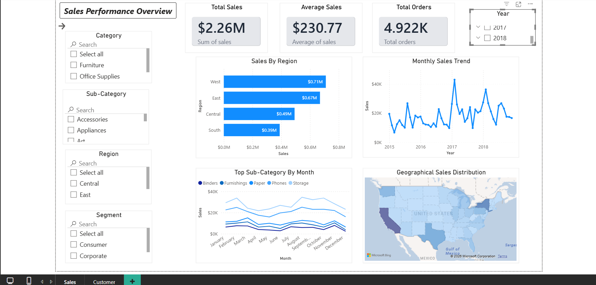
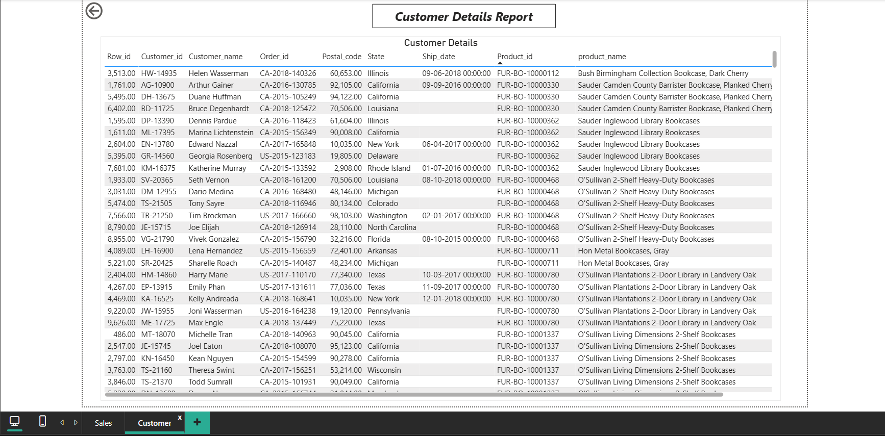
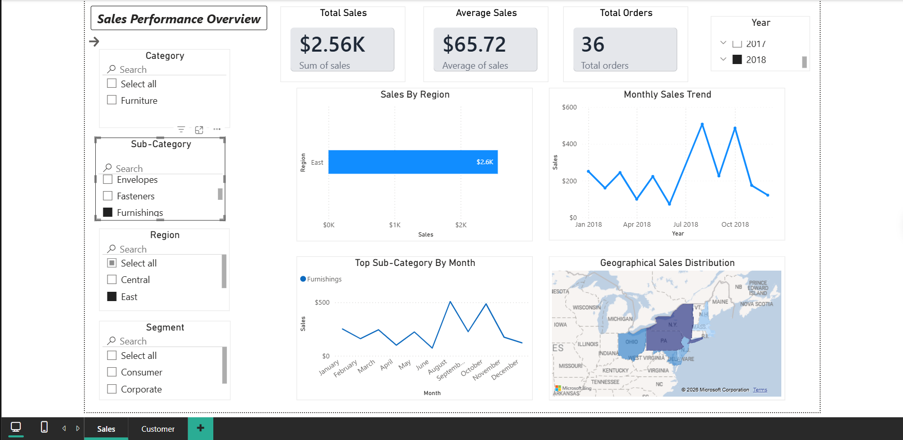

# 🏪 Retail Sales Pipeline - Production Documentation

## Overview

The **Retail Sales Pipeline** is an enterprise-grade ETL (Extract, Transform, Load) solution designed for comprehensive retail sales analytics and reporting. This pipeline automates the ingestion, transformation, and visualization of retail sales data to provide actionable business intelligence and customer insights.

**Key Capabilities:**
- Automated data ingestion from multiple sources
- Real-time data quality validation and transformation
- Advanced analytics including Pareto (80/20) customer analysis
- Interactive dashboards for sales performance tracking
- Scalable SQLite database architecture

---

## 📊 Data Flow Architecture

```
┌─────────────────────────────────────────────────────────────────────┐
│                         DATA PIPELINE FLOW                           │
└─────────────────────────────────────────────────────────────────────┘

	 ┌──────────────┐
	 │  CSV DATA    │ (train.csv, pareto_customers.csv)
	 │  SOURCE      │
	 └──────┬───────┘
			  │
			  ▼
	 ┌──────────────────────────────────────────────┐
	 │    EXTRACT STAGE                             │
	 │  • Read CSV files using Pandas               │
	 │  • Initial data inspection                   │
	 │  • Row count logging                         │
	 └──────┬───────────────────────────────────────┘
			  │
			  ▼
	 ┌──────────────────────────────────────────────┐
	 │    TRANSFORM STAGE                           │
	 │  • Clean column names (strip, lowercase)     │
	 │  • Convert date formats (order_date, etc.)   │
	 │  • Convert numeric fields (sales)            │
	 │  • Data type standardization                 │
	 │  • Null value validation                     │
	 └──────┬───────────────────────────────────────┘
			  │
			  ▼
	 ┌──────────────────────────────────────────────┐
	 │    DATA QUALITY CHECK                        │
	 │  • Null value detection                      │
	 │  • Data type validation                      │
	 │  • Quality metrics logging                   │
	 └──────┬───────────────────────────────────────┘
			  │
			  ▼
	 ┌──────────────────────────────────────────────┐
	 │    LOAD STAGE (SQLite)                       │
	 │  • Write to sales_data table                 │
	 │  • Create/replace table as configured        │
	 │  • Index optimization                        │
	 └──────┬───────────────────────────────────────┘
			  │
			  ▼
	 ┌──────────────────────────────────────────────┐
	 │    DATABASE LAYER (sales.db)                 │
	 │  • sales_data (main fact table)              │
	 │  • monthly_sales (view)                      │
	 │  • pareto_customers (view)                   │
	 └──────┬───────────────────────────────────────┘
			  │
			  ├─────────────────────┬─────────────────────┐
			  ▼                     ▼                     ▼
	 ┌─────────────┐      ┌─────────────┐      ┌─────────────┐
	 │   Power BI  │      │  Analytics  │      │   CSV       │
	 │  Dashboard  │      │  Queries    │      │   Export    │
	 └─────────────┘      └─────────────┘      └─────────────┘
```

---

## 📈 Dashboard Views

### Sales Dashboard

*Real-time sales metrics, trends, and performance KPIs*

### Customer Dashboard

*Customer segmentation, lifetime value, and behavior analysis*

### Regional Filter View

*Regional performance and filtering capabilities*

---

## 🎯 Key Features

### 1. **Automated ETL Pipeline**
	- Batch processing of retail sales data
	- Automated data quality checks
	- Error logging and monitoring

### 2. **Advanced Analytics**
	- **Pareto Analysis**: Identifies top 20% of customers contributing 80% of sales
	- **Monthly Sales Aggregation**: Tracks temporal sales trends
	- **Customer Segmentation**: Groups customers by value and behavior

### 3. **Interactive Dashboards**
	- Sales performance tracking
	- Customer analytics and insights
	- Regional performance monitoring
	- Power BI integration

### 4. **Data Quality Management**
	- Null value detection and handling
	- Data type validation
	- Duplicate detection and removal
	- Data consistency checks

---

## 🛠️ Tech Stack

| Component | Technology |
|-----------|-----------|
| **ETL Framework** | Python 3.x |
| **Data Processing** | Pandas, NumPy |
| **Database** | SQLite 3 |
| **Data Visualization** | Microsoft Power BI |
| **Analytics** | SQL, Python |
| **Configuration** | JSON Settings |
| **Data Format** | CSV, SQLite DB |

---

## 📦 Dependencies

```
pandas          # Data manipulation and ETL
numpy           # Numerical computing
db-sqlite3      # SQLite database interface
openpyxl        # Excel file support
```

**Installation:**
```bash
pip install -r Requirement.txt
```

---

## 🚀 Getting Started

### Prerequisites
- Python 3.8+
- pip (Python package manager)
- SQLite3 (included with Python)
- Power BI Desktop (optional, for dashboard viewing)

### Installation Steps

1. **Clone the Repository**
	```bash
	git clone <repository-url>
	cd Retail_Sales_Pipeline
	```

2. **Create Virtual Environment** (Recommended)
	```bash
	python -m venv venv
	source venv/bin/activate  # On Windows: venv\Scripts\activate
	```

3. **Install Dependencies**
	```bash
	pip install -r Requirement.txt
	```

4. **Verify SQLite Installation**
	```bash
	sqlite3 --version
	```

---

## 📋 Project Structure

```
Retail_Sales_Pipeline/
├── etl_dataframe.py              # Main ETL pipeline script
├── monthly_sales.sql             # Monthly aggregation view
├── pareto_analysis.sql           # Pareto customer analysis view
├── sales.db                      # SQLite database
├── train.csv                     # Source data file
├── pareto_customers.csv          # Pareto analysis results
├── Sales_Dashboard.png           # Sales visualization
├── Customer_Dashboard.png        # Customer analytics dashboard
├── East_Filter.png               # Regional filter example
├── Sales report.pbix             # Power BI report file
├── Sales_&_Customer_Report_Overview.mp4  # Demo video
├── settings.json                 # Configuration settings
├── Requirement.txt               # Python dependencies
└── README_PRODUCTION.md          # This file
```

---

## 🔄 Data Pipeline Workflow

### Step 1: Extract
- Reads CSV files (train.csv)
- Loads data into Pandas DataFrame
- Logs initial row counts

**Code:**
```python
df = pd.read_csv(CSV_PATH)
rows_before = len(df)
```

### Step 2: Transform
- **Column Standardization**: Strip whitespace, convert to lowercase, replace spaces with underscores
- **Date Conversion**: Parse order_date and ship_date to datetime format
- **Numeric Conversion**: Convert sales values to proper numeric types
- **Data Type Alignment**: Ensure consistency across fields

**Sample Transformations:**
```python
# Clean column names
df.columns = df.columns.str.strip().str.lower().str.replace(" ", "_")

# Convert date columns
df["order_date"] = pd.to_datetime(df["order_date"], errors="coerce")
df["ship_date"] = pd.to_datetime(df["ship_date"], errors="coerce")

# Convert numeric fields
df["sales"] = pd.to_numeric(df["sales"], errors="coerce")
```

### Step 3: Validate
- Check for null values in critical fields (order_date, ship_date, sales)
- Log data quality metrics
- Identify anomalies or missing data patterns

**Validation Output:**
```
Null values:
order_date:  0
ship_date:   0
sales:       0
```

### Step 4: Load
- Write cleaned data to SQLite database
- Create or replace `sales_data` table
- Maintain data integrity and relationships

**Database Load:**
```python
df.to_sql(
	 name="sales_data",
	 con=conn,
	 if_exists="replace",
	 index=False
)
```

---

## 📊 Analytics & Views

### Monthly Sales View
Aggregates sales data by month for trend analysis:
```sql
CREATE VIEW monthly_sales AS
SELECT
	 strftime('%Y-%m', order_date) AS sales_month,
	 SUM(sales) AS total_monthly_sales
FROM sales_data 
GROUP BY sales_month
```

### Pareto Customer Analysis
Identifies top-value customers contributing 80% of sales:
```sql
CREATE VIEW pareto_customers AS
SELECT
	 customer_id,
	 customer_name,
	 total_sales,
	 cumulative_sales,
	 ROUND((cumulative_sales * 100.0) / overall_sales, 2) AS cumulative_sales_pct
FROM (
	 -- Customer aggregation with cumulative calculations
)
WHERE cumulative_sales_pct <= 85
ORDER BY total_sales DESC
```

**Key Insight:** Identifies the critical 20% of customers driving 80% of revenue.

---

## 🎲 Running the Pipeline

### Execute ETL Process
```bash
python etl_dataframe.py
```

**Expected Output:**
```
ETL Process Started
Rows extracted: [number]
Null values:
order_date:  0
ship_date:   0
sales:       0
ETL Completed Successfully
Data loaded into SQLite DB: sales.db
Table name: sales_data
```

### Query the Database
```bash
sqlite3 sales.db
sqlite> SELECT * FROM monthly_sales;
sqlite> SELECT * FROM pareto_customers;
```

---

## 📊 Dashboard Access

### Power BI Reports
Open `Sales report.pbix` in Microsoft Power BI Desktop to access:
- Interactive sales dashboards
- Customer segmentation analysis
- Regional performance metrics
- Trend analysis and forecasting

### Video Demo
Watch `Sales_&_Customer_Report_Overview.mp4` for a walkthrough of the dashboard features.

---

## 🔧 Configuration

Edit `settings.json` to customize:
- Data source paths
- Database location
- ETL parameters
- Output settings

---

## ⚠️ Data Quality & Error Handling

The pipeline includes robust error handling:
- **Coercion Strategy**: Invalid values are converted to NaN (not excluded)
- **Null Detection**: Logged for review and remediation
- **Type Safety**: Explicit type conversions prevent casting errors
- **Logging**: All operations are logged for audit trails

---

## 📈 Performance Considerations

- **Batch Processing**: Optimized for large CSV imports
- **Database Indexing**: SQLite indexes on key columns for query performance
- **Memory Usage**: Pandas DataFrames sized for typical retail datasets (1M+ records)
- **Incrementa Loading**: Configure `if_exists="append"` for incremental updates

---

## 🔐 Best Practices

1. **Data Backup**: Maintain backups of source CSV files
2. **Version Control**: Track changes to SQL queries and Python scripts
3. **Testing**: Validate data quality before production runs
4. **Monitoring**: Review logs regularly for anomalies
5. **Documentation**: Keep data dictionary and column definitions updated

---

## 📝 Maintenance

### Regular Tasks
- Monitor ETL logs for errors
- Update SQL queries as business requirements change
- Archive historical data periodically
- Refresh Power BI dashboards on schedule

### Troubleshooting

**Issue: "No such table" error**
- Solution: Run `etl_dataframe.py` to initialize database

**Issue: Null values in output**
- Solution: Check source CSV for data quality issues

**Issue: Slow query performance**
- Solution: Add indexes on frequently queried columns

---

## 📞 Support & Documentation

- **Database Queries**: See `.sql` files for query examples
- **Python Code**: Documented inline with comments
- **Dashboard Help**: Refer to Power BI documentation
- **Data Issues**: Check null value logs in ETL output

---

## 📜 License

[Specify your license here]

---

## 👥 Contributors

- Development Team: Retail Analytics Initiative
- Last Updated: February 2026

---

## 🎯 Future Roadmap

- [ ] Real-time data ingestion (API integration)
- [ ] Machine learning forecasting models
- [ ] Automated alerting for anomalies
- [ ] Advanced customer segmentation
- [ ] Cloud database migration (AWS/Azure)
- [ ] RESTful API for dashboard integration
- [ ] Mobile analytics application

---

**For questions or issues, please contact the Data Engineering team.**
